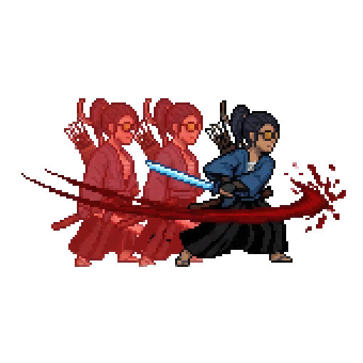
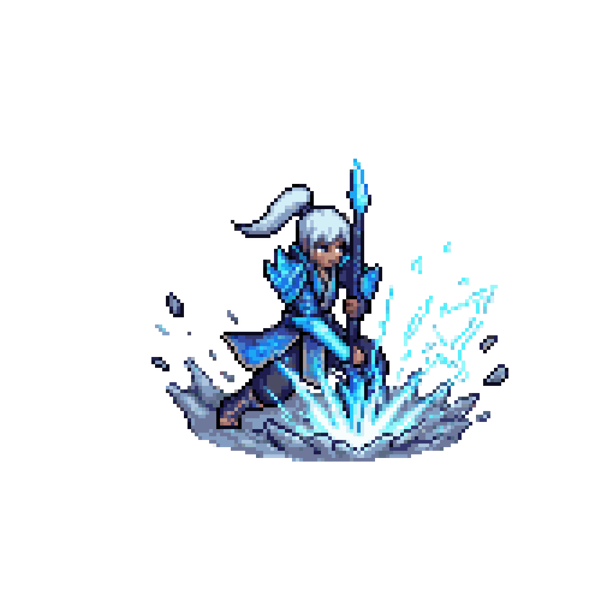
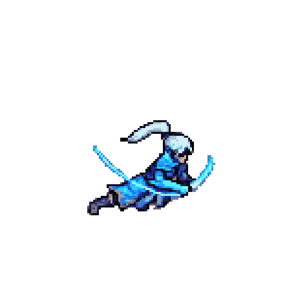

# Patch Notes

Este arquivo deve ser atualizado de forma sequencial a cada versao nova.

Regra do projeto:
- a versao mais recente fica sempre no topo
- as versoes antigas continuam abaixo, sem apagar historico
- sempre que possivel, cada patch deve trazer imagens reais dos assets implementados naquela entrega
- este arquivo na raiz e a fonte principal de historico do projeto
- notas antigas que nasceram em `docs/` devem ser consolidadas aqui com o tempo

---

## Indice

- [v0.2.0 - 2026-03-20](#v020---2026-03-20)
- [v0.1.1 - 2026-03-15](#v011---2026-03-15)

---

## v0.2.0 - 2026-03-20

### Destaques

- Grande reorganizacao do projeto comparada ao estado publicado em `origin/main`, consolidando a base atual de gameplay, apresentacao e dados dos personagens.
- Sistema de personagens expandido com `CharacterCatalog`, `BootstrapProfile`, catalogos de animacao/audio e resolucao mais clara dos assets em runtime.
- `MatchController` e a montagem de combate foram retrabalhados com estrutura de `roster`, `slot profiles` e configuracao mais consistente para os combatentes.
- Fluxo de input e combate evoluiu com novas interfaces e fontes de input, preparando melhor o projeto para keyboard, gamepad e futuras expansoes.
- Arena e apresentacao visual foram atualizadas com fundo novo, suporte a video background, parallax e ferramentas melhores para enxergar o greybox real.
- Movimento e colisao receberam varios passes de polimento para rampas, quinas, wall jump, contato lateral e leitura de hitboxes.
- Ferramentas de editor foram reforcadas para sincronizar assets, validar conteudo, configurar cena de play mode e ajustar dados de combate com menos atrito.

### Gameplay e combate

- Controller do player revisado para deixar deslocamento, resposta no ar e navegacao em rampas mais estaveis.
- Contato lateral com paredes e quinas foi retrabalhado para evitar kick repetido e melhorar a janela de wall jump.
- Hit detection, anchors e lancamento de projeteis ganharam uma base mais robusta com novos componentes e estruturas de contexto em runtime.
- A leitura visual do greybox foi melhorada para facilitar ajuste de colisao e layout da arena.

### Personagens, dados e pipeline

- Catalogos e definicoes dos personagens foram reorganizados para reduzir dependencia de configuracoes antigas e centralizar melhor audio, animacao e bootstrap.
- Animacoes de Mizu e Storm Dragon foram atualizadas em larga escala, incluindo ultimates, locomocao, combate e morte.
- Novos assets de dados foram adicionados para roster, slots de combate, audio e sincronizacao de animacoes.
- O pipeline de importacao e sincronizacao no editor foi ampliado para manter sprites, acoes e configuracoes mais alinhados com o estado atual do projeto.

### Arena, apresentacao e debug

- Cena `Bootstrap` recebeu uma revisao extensa e hoje representa muito melhor o estado jogavel atual.
- Fundo principal da arena foi atualizado para a arte mais recente do jogo.
- Sistema de `ProjectPvpVideoBackground` foi refinado para conviver melhor com configuracao manual no `VideoPlayer`.
- Gizmos do greybox agora conseguem desenhar mais tipos de `Collider2D`, facilitando leitura e manutencao da arena.
- Ferramentas de debug, HUD e gizmos de combate foram ajustadas junto com o restante da base.

### Ferramentas e infraestrutura

- Entraram novas ferramentas de editor para sync de assets, utilitarios de cena, validacao do projeto e apoio ao fluxo de importacao.
- A configuracao de play mode no editor foi ajustada para respeitar melhor a cena ativa quando a propria `Bootstrap` ja esta aberta.
- Estrutura de pacotes, projeto e runtime assembly foi atualizada para acompanhar a nova organizacao interna.

### Imagens deste patch

#### Arena Atual

#### Mizu - Ultimate Atual

#### Storm Dragon - Ultimate Atual

#### Arena Antiga

#### Arena Nova

## v0.1.1 - 2026-03-15

### Destaques

- Melhorias de movimentacao dos personagens para deixar o combate mais consistente e responsivo.
- Ajustes de colisao da flecha, incluindo o tratamento das hitboxes para evitar mortes injustas fora do corpo real do personagem.
- Polimento das hitboxes de ataque `melee` e `ultimate` dos dois personagens, com anchors editaveis diretamente na cena.
- Polimento do `ProjectileOrigin` para alinhar melhor os disparos com o sprite e com o gameplay.
- Nova `ultimate` da Storm Dragon implementada no jogo.
- Nova `ultimate` da Mizu implementada no jogo com dash curto, bloqueio de flechas e repeticao da sombra.
- O ataque `melee` da Mizu agora consegue cortar flechas e inutiliza-las no meio do combate.
- Mapa ajustado com melhor enquadramento e zoom para combinar com a escala dos personagens e do combate.
- Animacoes de morte criadas e implementadas para os personagens jogaveis.

### Base tecnica desta versao

- Pipeline de importacao via PixelLab MCP expandido para sincronizar animacoes novas com mais seguranca.
- Sistema de spawn atualizado para respeitar melhor a posicao configurada na cena.
- Ferramentas de debug e edicao no Unity melhoradas para facilitar o ajuste fino de hitboxes e pontos de combate.

### Imagens deste patch

#### Mizu - Ultimate Red Afterimage

#### Storm Dragon - Ultimate

#### Storm Dragon - Death Animation

#### Arena da v0.1.1

