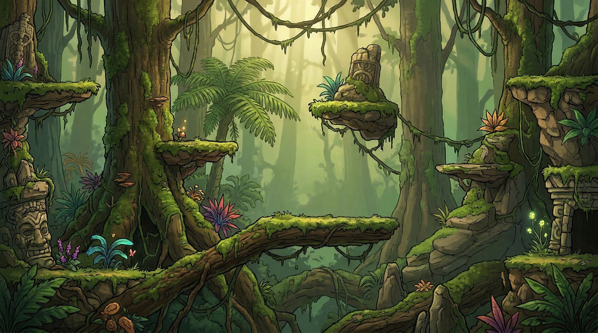
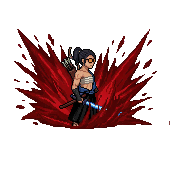
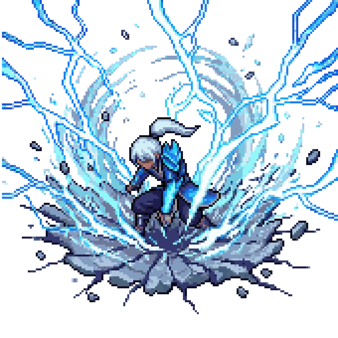
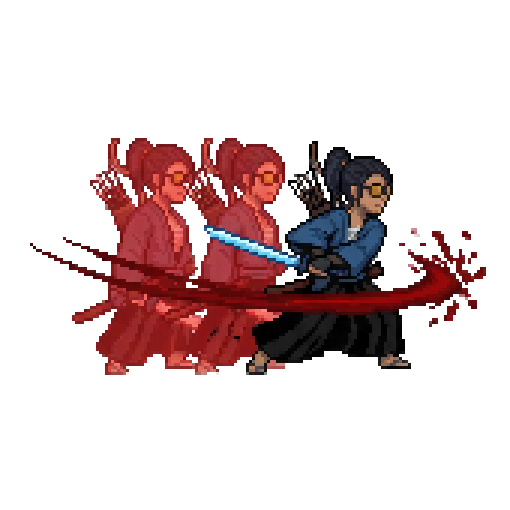
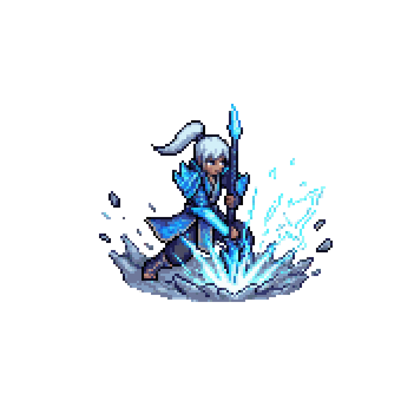
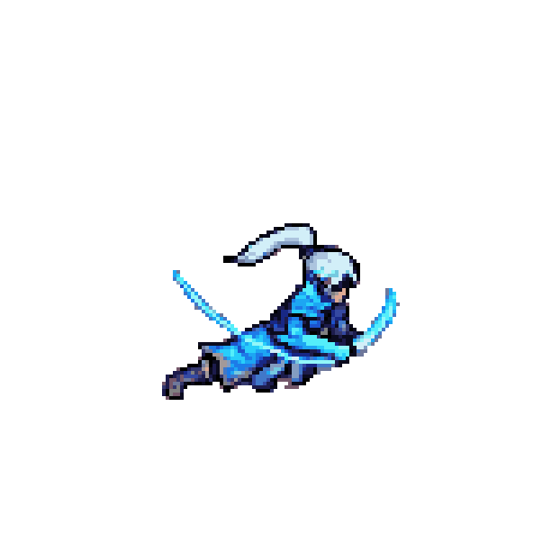

# Patch Notes

Este arquivo deve ser atualizado de forma sequencial a cada versao nova.

Regra do projeto:
- a versao mais recente fica sempre no topo
- as versoes antigas continuam abaixo, sem apagar historico
- sempre que possivel, cada patch deve trazer imagens reais dos assets implementados naquela entrega
- este arquivo na raiz e a fonte principal de historico do projeto
- notas antigas que nasceram em `docs/` devem ser consolidadas aqui com o tempo

---

## Indice

- [v0.3.0 - 2026-03-30](#v030---2026-03-30)
- [v0.2.0 - 2026-03-20](#v020---2026-03-20)
- [v0.1.1 - 2026-03-15](#v011---2026-03-15)

---

## v0.3.0 - 2026-03-30

### Destaques

- Unificacao da stack principal de bots em torno de `mainbot.py`, com broker unico, agentes por slot, memoria por bot e supervisao central do runtime.
- Expansao do controle externo para os dois lados da partida, permitindo `slot 1` e `slot 2` rodarem com bots separados ao mesmo tempo.
- Introducao do `Bot Manager v1`, com `roster`, atribuicoes por slot, perfis persistentes, conhecimento global, relatorios por bot e base para geracoes futuras.
- Criação de uma camada de observabilidade mais forte para video e analise, com `slot overlays` compactos e painel documental local para inspecionar a comunicacao entre Unity, broker e Codex.
- Consolidacao do fluxo de rounds como `first to 5 kills`, com HUD visual de bolinhas no topo e rotulo explicito para leitura mais clara durante partidas e videos.

### Analise tecnica do patch

Este patch muda o projeto de uma prova de conceito de `bot no slot 2` para uma estrutura mais proxima de produto interno:

- a Unity passou a consumir atribuicoes de bots em runtime, em vez de depender so de shortcuts hardcoded;
- o Python passou a ser a fonte de verdade da identidade e configuracao dos bots;
- a comunicacao com o Codex deixou de ser uma caixa-preta parcial e ganhou trilha estruturada de eventos;
- o projeto agora tem uma base muito mais forte para gravar material, depurar partidas, comparar modelos e documentar a evolucao dos bots.

O impacto pratico e que agora existe uma separacao mais limpa entre:

- `jogo e simulacao` na Unity;
- `orquestracao e memoria` no Python;
- `decisao tática` no Codex;
- `apresentacao e auditoria` nas novas ferramentas de overlay e documentary panel.

### Bot Manager, memoria e perfis

- Entrou um `Bot Manager` persistente para salvar `botId`, nome, estilo, skills, notas, provider, modelo, reasoning e atribuicoes por slot.
- Cada bot agora possui memoria privada e relatorios proprios, em vez de depender de uma memoria global singleton.
- O sistema foi preparado para promover bots por geracao com base em metricas, preservando `parentBotId` e historico de evolucao.
- Foi adicionado um menu Python minimalista para criar bots, editar perfis, escolher provider/model e validar o setup antes de subir a stack.

### Runtime multi-bot e unificacao slot 1 + slot 2

- O `mainbot.py` agora atua como supervisor real da stack.
- O supervisor sobe um `codex_live_agent.py` por slot ativo, passando `slotId`, `botId`, provider e modelo de forma isolada.
- `MatchController` foi ajustado para ler atribuicoes de runtime vindas do Python e aplicar automaticamente `AI + CodexBroker` aos slots habilitados.
- O jogo passou a respeitar de forma automatica a intencao configurada no bot menu ao entrar em `Play`, sem exigir reconfiguracao manual repetitiva no Unity.

### Relatorios e observabilidade

- Cada bot agora pode gerar relatorios separados por `round` e por `serie`, com arquivos distintos e memoria reaproveitavel.
- O loop do agente ganhou `trace events` para registrar:
  - warmup
  - prompt payload criado
  - request enviado ao Codex
  - resposta recebida
  - intent publicado
  - heartbeats e eventos de broker
- Foi criado um painel documental local em `localhost:8050` para visualizar esses eventos de maneira organizada.
- Tambem entraram janelas compactas por slot para leitura rapida do estado de cada bot durante a luta.

### HUD de rounds e fluxo de partida

- O projeto consolidou o modelo `1 kill = 1 round`.
- A partida usa `first to 5 kills`, com cinco indicadores visuais por lado no topo da tela.
- O HUD agora deixa a regra explicita com o texto `PRIMEIRO A 5 KILLS`, facilitando entendimento para video e playtest externo.
- Foram adicionados testes de editor cobrindo pontos do fluxo de rounds e reset de serie.

### Estado atual comparado ao patch anterior

Comparado ao `v0.2.0`, o projeto agora esta mais forte em tres eixos:

- `bot infrastructure`: muito mais madura;
- `debuggability`: muito melhor;
- `readability for showcase`: significativamente melhor.

O patch anterior consolidou base de gameplay, dados e cena. Este patch consolida principalmente:

- IA externa;
- gerenciamento de bots;
- rastreabilidade;
- apresentacao do experimento.

### Riscos e limites atuais

- O sistema de documentary panel ja e util, mas ainda esta em versao tecnica e nao final de UX.
- Parte da stack depende do ambiente local do Codex e dos perfis/autenticacao configurados no desktop.
- Ainda existem zonas do projeto com comportamento legadao de debug que vao precisar de limpeza progressiva nas proximas versoes.
- A validacao mais profunda do fluxo completo ainda depende de playtests reais no Unity, especialmente para polir narrativa visual e timing entre janela do bot, broker e partida.

### Arquivos centrais desta versao

- `mainbot.py`
- `tools/bot_manager.py`
- `tools/bot_menu.py`
- `tools/codex_memory.py`
- `tools/codex_live_agent.py`
- `tools/codex_broker.py`
- `tools/codex_report_console.py`
- `tools/codex_slot_console.py`
- `tools/codex_documentary_server.py`
- `tools/codex_trace_store.py`
- `Assets/ProjectPVP/Scripts/Runtime/Match/MatchController.cs`
- `Assets/ProjectPVP/Scripts/Runtime/Presentation/ProjectPvpRoundHudOverlay.cs`

### Imagens deste patch

Ainda nao foi exportado um conjunto curado de imagens desta versao. O patch foi focado principalmente em infraestrutura, HUD e ferramentas operacionais.

## v0.2.0 - 2026-03-20

### Destaques

- Grande reorganizacao do projeto comparada ao estado publicado em `origin/main`, consolidando a base atual de gameplay, apresentacao e dados dos personagens.
- Sistema de personagens expandido com `CharacterCatalog`, `BootstrapProfile`, catalogos de animacao/audio e resolucao mais clara dos assets em runtime.
- `MatchController` e a montagem de combate foram retrabalhados com estrutura de `roster`, `slot profiles` e configuracao mais consistente para os combatentes.
- Fluxo de input e combate evoluiu com novas interfaces e fontes de input, preparando melhor o projeto para keyboard, gamepad e futuras expansoes.
- Arena e apresentacao visual foram atualizadas com fundo novo, suporte a video background, parallax e ferramentas melhores para enxergar o greybox real.
- Movimento e colisao receberam varios passes de polimento para rampas, quinas, wall jump, contato lateral e leitura de hitboxes.
- Ferramentas de editor foram reforcadas para sincronizar assets, validar conteudo, configurar cena de play mode e ajustar dados de combate com menos atrito.

### Gameplay e combate

- Controller do player revisado para deixar deslocamento, resposta no ar e navegacao em rampas mais estaveis.
- Contato lateral com paredes e quinas foi retrabalhado para evitar kick repetido e melhorar a janela de wall jump.
- Hit detection, anchors e lancamento de projeteis ganharam uma base mais robusta com novos componentes e estruturas de contexto em runtime.
- A leitura visual do greybox foi melhorada para facilitar ajuste de colisao e layout da arena.

### Personagens, dados e pipeline

- Catalogos e definicoes dos personagens foram reorganizados para reduzir dependencia de configuracoes antigas e centralizar melhor audio, animacao e bootstrap.
- Animacoes de Mizu e Storm Dragon foram atualizadas em larga escala, incluindo ultimates, locomocao, combate e morte.
- Novos assets de dados foram adicionados para roster, slots de combate, audio e sincronizacao de animacoes.
- O pipeline de importacao e sincronizacao no editor foi ampliado para manter sprites, acoes e configuracoes mais alinhados com o estado atual do projeto.

### Arena, apresentacao e debug

- Cena `Bootstrap` recebeu uma revisao extensa e hoje representa muito melhor o estado jogavel atual.
- Fundo principal da arena foi atualizado para a arte mais recente do jogo.
- Sistema de `ProjectPvpVideoBackground` foi refinado para conviver melhor com configuracao manual no `VideoPlayer`.
- Gizmos do greybox agora conseguem desenhar mais tipos de `Collider2D`, facilitando leitura e manutencao da arena.
- Ferramentas de debug, HUD e gizmos de combate foram ajustadas junto com o restante da base.

### Ferramentas e infraestrutura

- Entraram novas ferramentas de editor para sync de assets, utilitarios de cena, validacao do projeto e apoio ao fluxo de importacao.
- A configuracao de play mode no editor foi ajustada para respeitar melhor a cena ativa quando a propria `Bootstrap` ja esta aberta.
- Estrutura de pacotes, projeto e runtime assembly foi atualizada para acompanhar a nova organizacao interna.

### Imagens deste patch

#### Arena Atual

#### Mizu - Ultimate Atual

#### Storm Dragon - Ultimate Atual

#### Arena Antiga

#### Arena Nova

## v0.1.1 - 2026-03-15

### Destaques

- Melhorias de movimentacao dos personagens para deixar o combate mais consistente e responsivo.
- Ajustes de colisao da flecha, incluindo o tratamento das hitboxes para evitar mortes injustas fora do corpo real do personagem.
- Polimento das hitboxes de ataque `melee` e `ultimate` dos dois personagens, com anchors editaveis diretamente na cena.
- Polimento do `ProjectileOrigin` para alinhar melhor os disparos com o sprite e com o gameplay.
- Nova `ultimate` da Storm Dragon implementada no jogo.
- Nova `ultimate` da Mizu implementada no jogo com dash curto, bloqueio de flechas e repeticao da sombra.
- O ataque `melee` da Mizu agora consegue cortar flechas e inutiliza-las no meio do combate.
- Mapa ajustado com melhor enquadramento e zoom para combinar com a escala dos personagens e do combate.
- Animacoes de morte criadas e implementadas para os personagens jogaveis.

### Base tecnica desta versao

- Pipeline de importacao via PixelLab MCP expandido para sincronizar animacoes novas com mais seguranca.
- Sistema de spawn atualizado para respeitar melhor a posicao configurada na cena.
- Ferramentas de debug e edicao no Unity melhoradas para facilitar o ajuste fino de hitboxes e pontos de combate.

### Imagens deste patch

#### Mizu - Ultimate Red Afterimage

#### Storm Dragon - Ultimate

#### Storm Dragon - Death Animation

#### Arena da v0.1.1

