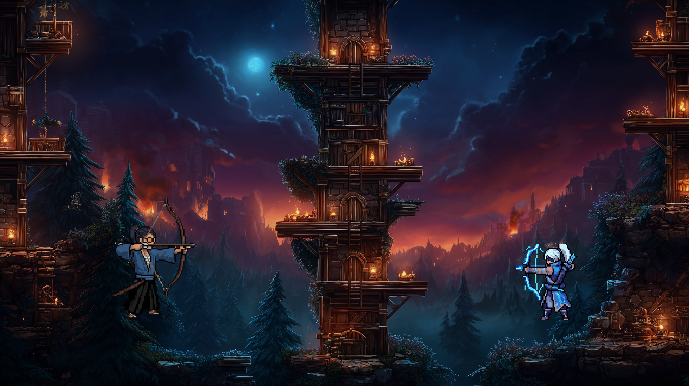
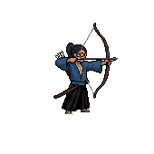
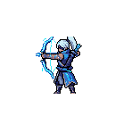

# The Last Arrow

  

Um prototipo PvP local em Unity que ja chegou naquele ponto gostoso em que a ideia comeca a virar jogo de verdade.

Sem enrolacao: a base ja esta de pe, os personagens ja tem identidade visual forte e o combate ja comeca a mostrar personalidade.

## O que ja temos de mais legal

- 2 personagens jogaveis com vibes bem diferentes
- combate local PvP funcionando
- tiro, melee, dash e ult no ar
- arena com uma atmosfera dark fantasy muito forte
- uma base solida para seguir polindo sensacao, impacto e estilo

## Personagens

<table>
  <tr>
    <td align="center" width="50%">
      
       
      <strong>Mizu</strong>
       
      Arqueira rapida, precisa e perigosa de longe.
    </td>
    <td align="center" width="50%">
      
       
      <strong>Storm Dragon</strong>
       
      Presenca eletrica, agressiva e feita para pressionar.
    </td>
  </tr>
</table>

## Agora a ideia e evoluir isso aqui

- deixar o combate ainda mais gostoso de jogar
- melhorar feedback visual, clareza e impacto
- empurrar mais a identidade de cada personagem
- transformar o prototipo 0.1 em uma vertical slice cada vez mais forte

## Video rapido

Tambem gravei um video mostrando a estrutura do projeto, as mecanicas basicas e o caminho que quero seguir daqui pra frente.

Quando quiser publicar, e so trocar este link:

[assistir ao video do projeto](COLE_O_LINK_DO_VIDEO_AQUI)
