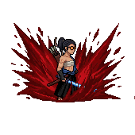
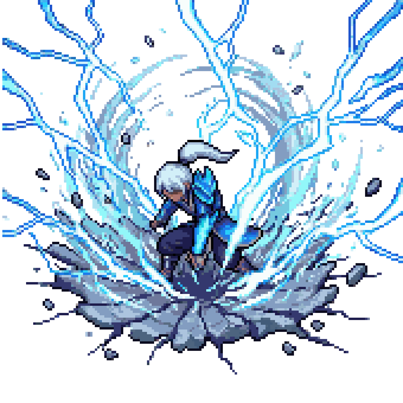

# The Last Arrow

  

Um prototipo de combate 2D em Unity pensado para crescer com foco em partidas online e locais.

a base ja esta de pe, os personagens ja tem identidade visual forte e o combate ja comeca a mostrar personalidade.

Patch notes do projeto: [PatchNotes.md](PatchNotes.md)

## O que ja temos de mais legal

- 2 personagens jogaveis com vibes bem diferentes
- combate base ja funcionando e pronto para evoluir
- tiro, melee, dash e ult no ar
- arena com identidade visual propria e espaco claro para evoluir o estilo
- uma base solida para seguir polindo sensacao, impacto e estilo
- um caminho claro para levar o projeto bem no online e no local

## Estrutura pensada para crescer

- `Scripts/Runtime` separado por responsabilidade, com blocos como `Core`, `Gameplay`, `Input`, `Match` e `Presentation`
- personagens organizados em pastas proprias com animacoes, dados e rotacoes, sem misturar tudo num lugar so
- area `Shared` para o que e comum entre personagens e `Resources` para centralizar o que precisa ser carregado
- uma base modular e simples de manter, que facilita ajustar mecanicas, adicionar conteudo novo e seguir evoluindo o projeto sem virar bagunca

## Personagens

<table>
  <tr>
    <td align="center" width="50%">
      
       
      <strong>Mizu</strong>
       
      Samurai veloz que abusa de sua destreza e cortes rapidos no combate
    </td>
    <td align="center" width="50%">
      
       
      <strong>Storm Dragon</strong>
       
      Artista marcial com elementos eletricos 
    </td>
  </tr>
</table>

## Agora a ideia e evoluir isso aqui

- deixar o combate ainda mais gostoso de jogar
- melhorar feedback visual, clareza e impacto
- empurrar mais a identidade de cada personagem

## Video rapido

Tambem gravei um video mostrando a estrutura do projeto, as mecanicas basicas e o caminho que quero seguir daqui pra frente.
